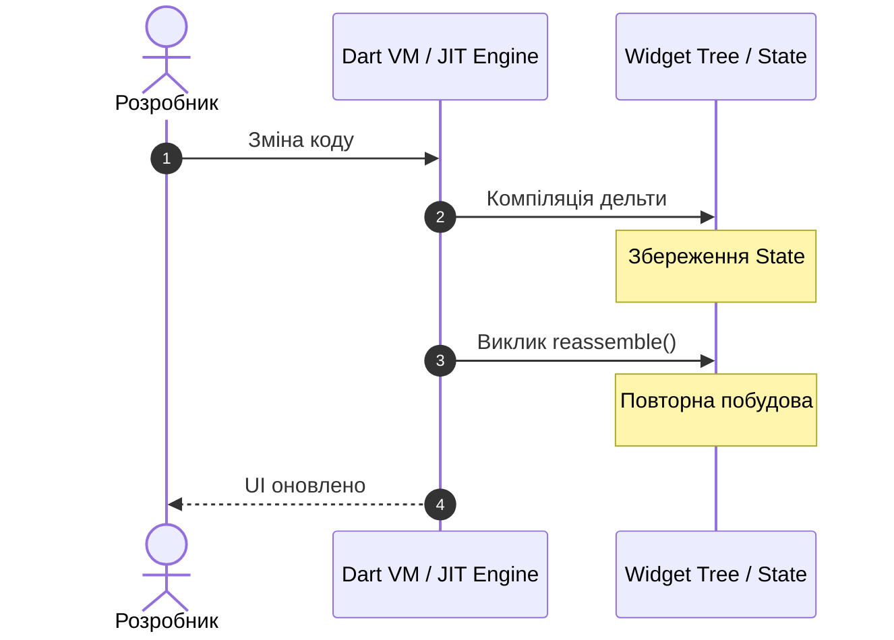

Практична робота 2: Технологія Flutter

Варіант 5: Чому саме Dart

1. Різниця між JIT та AOT під час компіляції та роль у процесі розробки.
JIT - компіляція відбувається під час виконання програми. Програма запускається як початковий код/байткод і транслюється в машинний код прямо на ходу. Це є зручним під час розробки.

AOT -  компіляція відбувається заздалегідь, до запуску програми. Весь код повністю перетворюється на готовий бинарний файл ще на комп'ютері, тому його використовують для релізу.

2. Як гаряче перезавантаження зберігає стан застосунку.

1. крок - Зміна коду: Розробник зберігає файл з новими змінами. Сигнал надходить до Dart VM.
   
2. крок - Компіляція дельти та Збереження State:
Компіляція дельти: JIT-компілятор за частки секунди компілює тільки ті файли/класи, які змінилися, і відправляє їх у запущену віртуальну машину.
Збереження State: У цей момент об'єкти State не знищуються і не скидаються. Вони залишаються недоторканими.

3. крок - Виклик reassemble() та Повторна побудова:
Виклик reassemble(): Dart VM дає команду Flutter перебудувати інтерфейс.
Повторна побудова: Викликається метод build(). Створюється нове дерево віджетів із використанням оновленого коду, але воно зв'язується з тими самими об'єктами State, які збереглися на кроці 2.

4. крок - UI оновлено: Dart VM повертає підтвердження, і на екрані пристрою/емулятора миттєво з'являється новий UI, при цьому всі введені дані та відкриті екрани зберігаються.

3. Описати модель ізолятів і пояснити, чому вона усуває цілий клас помилок
багатопотоковості.

4. Пояснити, чому збирач сміття Dart добре підходить саме до моделі, де на кожен кадр
створюються тисячі короткоживучих об'єктів.

5. Назвати одну мову-альтернативу і показати, якої з чотирьох властивостей їй бракує.
