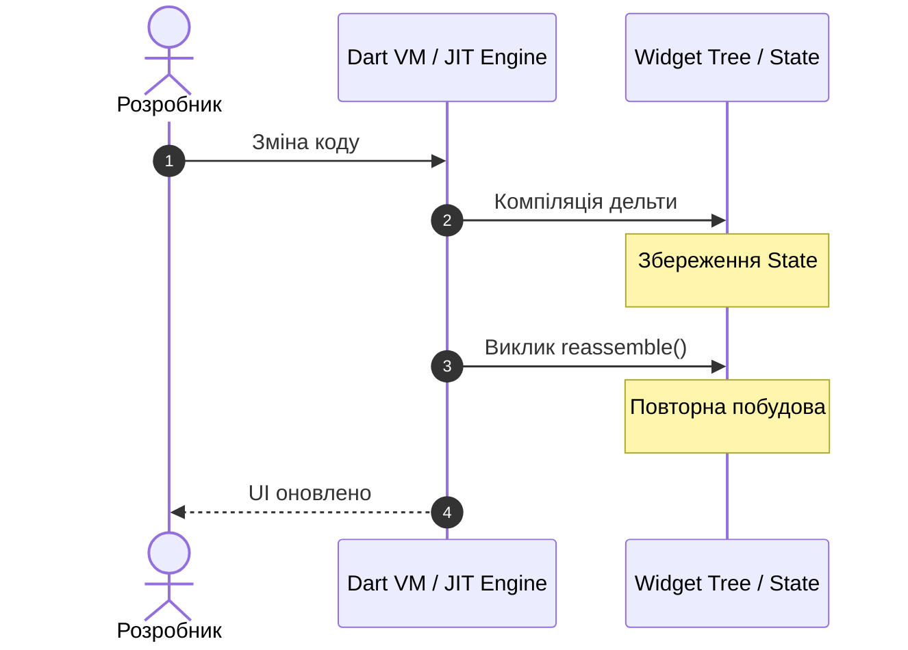

Практична робота 2: Технологія Flutter

Варіант 5: Чому саме Dart

1. Різниця між JIT та AOT під час компіляції та роль у процесі розробки.
JIT - компіляція відбувається під час виконання програми. Програма запускається як початковий код/байткод і транслюється в машинний код прямо на ходу. Це є зручним під час розробки.

AOT -  компіляція відбувається заздалегідь, до запуску програми. Весь код повністю перетворюється на готовий бинарний файл ще на комп'ютері, тому його використовують для релізу.

2. Як гаряче перезавантаження зберігає стан застосунку.

1. крок - Зміна коду: Розробник зберігає файл з новими змінами. Сигнал надходить до Dart VM.
   
2. крок - Компіляція дельти та Збереження State:
Компіляція дельти: JIT-компілятор за частки секунди компілює тільки ті файли/класи, які змінилися, і відправляє їх у запущену віртуальну машину.
Збереження State: У цей момент об'єкти State не знищуються і не скидаються. Вони залишаються недоторканими.

3. крок - Виклик reassemble() та Повторна побудова:
Виклик reassemble(): Dart VM дає команду Flutter перебудувати інтерфейс.
Повторна побудова: Викликається метод build(). Створюється нове дерево віджетів із використанням оновленого коду, але воно зв'язується з тими самими об'єктами State, які збереглися на кроці 2.

4. крок - UI оновлено: Dart VM повертає підтвердження, і на екрані пристрою/емулятора миттєво з'являється новий UI, при цьому всі введені дані та відкриті екрани зберігаються.

3. Моделі ізолятів, чому вона усуває цілий клас помилок багатопотоковості.
У традиційних мовах декілька потоків можуть одночасно читати й змінювати одні й ті самі змінні в спільній пам'яті. Це призводить до критичних помилок:
    Data Races: коли два потоки одночасно змінюють одну змінну, що викликає непередбачувані баги.
    Deadlocks: ситуації, коли потоки блокують один одного у спробі отримати доступ до ресурсів.

У Dart ізоляти не мають спільної пам'яті. Один ізолят фізично не може прочитати чи змінити змінні іншого. Спілкування відбувається виключно через передачу повідомлень за допомогою спеціальних портів. Відсутність спільної пам'яті повністю усуває Data Races та Deadlocks.

Асинхронне виконання важкого обчислення в окремому ізоляті:
```dart
import 'dart:isolate';

// Важка обчислювальна функція, яка виконуватиметься в окремому ізоляті
void heavyComputation(SendPort sendPort)
 {
  int result = 0;
  for (int i = 0; i < 1000000000; i++)
  {
    result += i;
  }
  // Надсилаємо результат назад у головний потік
  sendPort.send(result);
}

void main() async
 {
  //Створюємо порт для отримання даних у головному ізоляті
  final receivePort = ReceivePort();

  //Запускаємо новий ізолят та передаємо йому SendPort для відповіді
  await Isolate.spawn(heavyComputation, receivePort.sendPort);

  //Чекаємо на повідомлення з нового ізоляту
  final result = await receivePort.first;
  print('Результат обчислень з ізоляту: $result');
}
```
