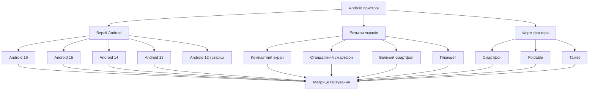

# Варіант 3: Дослідження фрагментації Android

## 1. Розподіл версій Android

Android має значну фрагментацію версій операційної системи. Одночасно використовуються як нові, так і старі версії Android.
За даними AppBrain, розподіл версій Android:

| Версія Android | API level | Частка |
|---|---:|---:|
| Android 16 | 36 | 25,2% |
| Android 15 | 35 | 15,7% |
| Android 14 | 34 | 13,4% |
| Android 13 | 33 | 12,7% |
| Android 12 | 31 | 10,8% |
| Android 11 | 30 | 9,3% |
| Android 10 | 29 | 4,9% |
| Android 9 | 28 | 3,6% |
| Android 8.0–8.1 | 26–27 | 1,8% |
| Android 7.0–7.1 | 24–25 | 1,5% |

**Джерело:** AppBrain, *Top Android OS versions*.  
https://www.appbrain.com/stats/top-android-sdk-versions

## 2. Визначення мінімальної версії API

Для визначення мінімальної версії API потрібно поступово додавати частки нових версій Android.

| Мінімальний API | Версії, які покриваються | Сумарне покриття |
|---:|---|---:|
| API 36 | Android 16 | 25,2% |
| API 35 | Android 15–16 | 40,9% |
| API 34 | Android 14–16 | 54,3% |
| API 33 | Android 13–16 | 67,0% |
| API 31 | Android 12–16 | 77,8% |
| API 30 | Android 11–16 | 87,1% |
| API 29 | Android 10–16 | **92,0%** |

Розрахунок для API 29:
```text
25,2 + 15,7 + 13,4 + 12,7 + 10,8 + 9,3 + 4,9 = 91,99%
```

Отже, для покриття **не менше 90% пристроїв** мінімальна версія повинна бути:
```text
minSdkVersion = 29
```

API 29 відповідає **Android 10**.
Таким чином, вибір Android 10 дозволяє охопити приблизно **92% пристроїв** за використаною статистикою.
Для нового застосунку також потрібно враховувати вимоги Google Play щодо `targetSdkVersion`. Для актуальних застосунків потрібно використовувати сучасний target API.

**Джерело:** Google Android Developers, *Meet Google Play's target API level requirement*.  
https://developer.android.com/google/play/requirements/target-sdk

## 3. Фрагментація розмірів екранів
Фрагментація Android стосується не тільки версій операційної системи. Існує велика кількість різних розмірів екранів та співвідношень сторін.
Приклади найбільш поширених роздільних здатностей:

| Роздільна здатність | Частка |
|---|---:|
| 414×896 | 13,63% |
| 360×800 | 9,25% |
| 390×844 | 6,81% |
| 393×873 | 5,27% |
| 384×832 | 4,35% |
| 360×780 | 3,17% |

**Джерело:** StatCounter, *Mobile Screen Resolution Stats Worldwide*.   
https://gs.statcounter.com/screen-resolution-stats/mobile

Тому під час тестування потрібно перевіряти не тільки різні версії Android, а й різні типи екранів.
Особливо важливо перевірити:
- невеликий екран;
- стандартний смартфон;
- великий смартфон;
- планшет;
- зміну орієнтації екрана;
- нестандартне співвідношення сторін;
- foldable-пристрої.

**Джерело:** Google Android Developers, *App orientation, aspect ratio, and resizability*.  
https://developer.android.com/develop/adaptive-apps/guides/app-orientation-aspect-ratio-resizability

## 4. Вплив фрагментації на тестування
Фрагментацію можна представити наступною схемою:



Через фрагментацію тестувальнику потрібно враховувати декілька параметрів одночасно.
Наприклад, один і той самий застосунок може працювати по-різному на Android 16 і Android 11 або мати проблеми з інтерфейсом на вузькому екрані та планшеті.
Тому перевіряти тільки одну модель смартфона недостатньо.

## 5. Матриця тестових пристроїв
Для тестування не потрібно перевіряти абсолютно всі моделі Android. Доцільніше вибрати пристрої, які представляють різні версії ОС, розміри екранів та виробників.

| № | Пристрій / клас | Версія Android | Тип екрана | Причина вибору |
|---:|---|---|---|---|
| 1 | Google Pixel | Android 16 | Стандартний смартфон | Перевірка актуальної версії Android |
| 2 | Samsung Galaxy A-серії | Android 15 | Середній смартфон | Популярний середній клас та One UI |
| 3 | Xiaomi Redmi Note | Android 14 | Великий смартфон | Інший виробник та оболонка Android |
| 4 | Samsung Galaxy старішого покоління | Android 13 | Стандартний смартфон | Перевірка старішої поширеної версії |
| 5 | Android-пристрій з Android 11 | Android 11 | Компактний/середній | Перевірка нижньої межі тестової матриці |
| 6 | Samsung Galaxy Z Fold | Android 16 | Foldable | Перевірка адаптивного інтерфейсу |
| 7 | Android Tablet | Android 16 | Планшет | Перевірка великого екрана |

Основними критеріями вибору є:
1. різні версії Android;
2. різні виробники;
3. різні розміри екранів;
4. різні форм-фактори;
5. різні оболонки Android.

Для звичайного регресійного тестування достатньо перших **5 конфігурацій**. Foldable та планшет можна додати, якщо застосунок повинен підтримувати великі екрани.

## 6. Порівняння з iOS
На відміну від Android, екосистема iOS має значно меншу фрагментацію. Apple одночасно контролює операційну систему та апаратні пристрої.
За даними StatCounter, у серпні 2026 року основними версіями iOS були:

| Версія iOS | Частка |
|---|---:|
| iOS 26.6 | 34,29% |
| iOS 26.5 | 32,71% |
| iOS 18.7 | 10,36% |
| iOS 26.3 | 2,30% |
| iOS 26.2 | 2,04% |
| iOS 16.7 | 1,84% |

**Джерело:** StatCounter, *iOS Version Market Share Worldwide*.  
https://gs.statcounter.com/ios-version-market-share/

Apple також повідомляє, що станом на 7 червня 2026 року **79% усіх iPhone** використовували iOS 26. Серед iPhone, випущених протягом останніх чотирьох років, частка iOS 26 становила **86%**.

Для звичайного застосунку, який працює тільки на iPhone, достатньо приблизно 3 основних конфігурацій:
| Конфігурація | Тип пристрою | Що перевіряється |
|---|---|---|
| 1 | Великий iPhone | Великий екран |
| 2 | Стандартний iPhone | Основний сценарій використання |
| 3 | Компактний/старіший iPhone | Малий екран та старіше обладнання |

Якщо застосунок повинен підтримувати iPad, потрібно додати ще 1–2 конфігурації для планшетів.
Таким чином, приблизна кількість конфігурацій для базового тестування виглядає так:

| Платформа | Кількість конфігурацій |
|---|---:|
| Android | 5–7 |
| iOS, тільки iPhone | 3 |
| iOS + iPad | 4–5 |

Причина такої різниці полягає в тому, що Android має набагато більше виробників, моделей, оболонок, розмірів екранів та апаратних характеристик.

## 7. Висновок
У ході роботи була проаналізована фрагментація Android, була створена тоблиця "Розподілу версій",визначен мінімальний API для покриття 90%, дослідженно фрагментацію розмірів екрану та створена схема впливу фрагментації на тестування з метрецею тестових пристроїв.

### Рішення
Для гіпотетичного Android-застосунку доцільно використовувати:
```text
minSdkVersion = 29
```
та тестувати щонайменше **5 різних конфігурацій пристроїв**.

**1. Покриття користувачів**
Android 10 (API 29) разом із новішими версіями охоплює приблизно **92% пристроїв** у використаній статистиці. Це перевищує необхідний поріг у 90%.

**2. Фрагментація пристроїв**
Навіть при однаковій версії Android пристрої можуть мати різні екрани, виробників та оболонки. Тому матриця з 5-7 конфігурацій краще представляє реальні умови використання.

**3. Порівняння з iOS**
Для iOS потрібно менше конфігурацій, оскільки Apple контролює апаратну платформу та операційну систему. Для Android потрібно приділяти більше уваги сумісності.

### Основний ризик
Навіть матриця з 5–7 пристроїв не може охопити всі існуючі Android-пристрої. Залишаються відмінності між виробниками, оболонками, процесорами, налаштуваннями шрифтів та нестандартними екранами.

Тому після випуску застосунку бажано аналізувати реальні помилки та статистику використання і відповідно змінювати пріоритети тестування.

## Джерела

1. **AppBrain - Top Android OS versions**  
   https://www.appbrain.com/stats/top-android-sdk-versions  

2. **StatCounter - Android Version Market Share**  
   https://gs.statcounter.com/android-version-market-share/mobile  

3. **StatCounter - Mobile Screen Resolution Stats**  
   https://gs.statcounter.com/screen-resolution-stats/mobile  

4. **Google Android Developers - Meet Google Play's target API level requirement**  
   https://developer.android.com/google/play/requirements/target-sdk  

5. **Google Android Developers - App orientation, aspect ratio, and resizability**  
   https://developer.android.com/develop/adaptive-apps/guides/app-orientation-aspect-ratio-resizability  

6. **StatCounter - iOS Version Market Share Worldwide**  
   https://gs.statcounter.com/ios-version-market-share/  

7. **Apple Developer - App Store Support**  
   https://developer.apple.com/support/app-store/  
